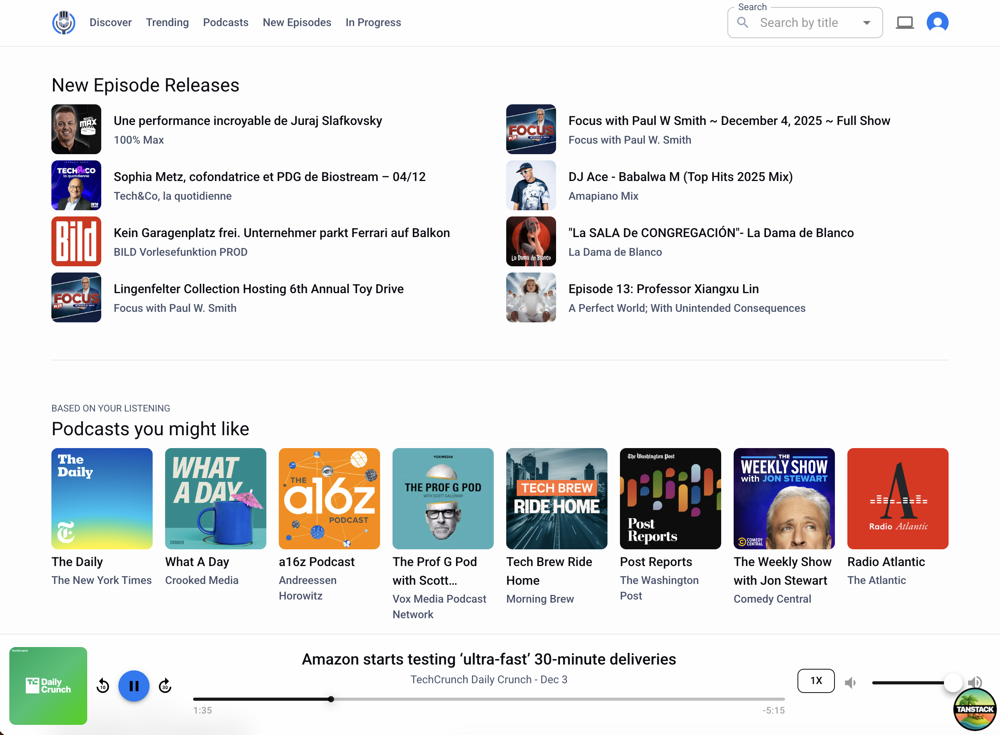
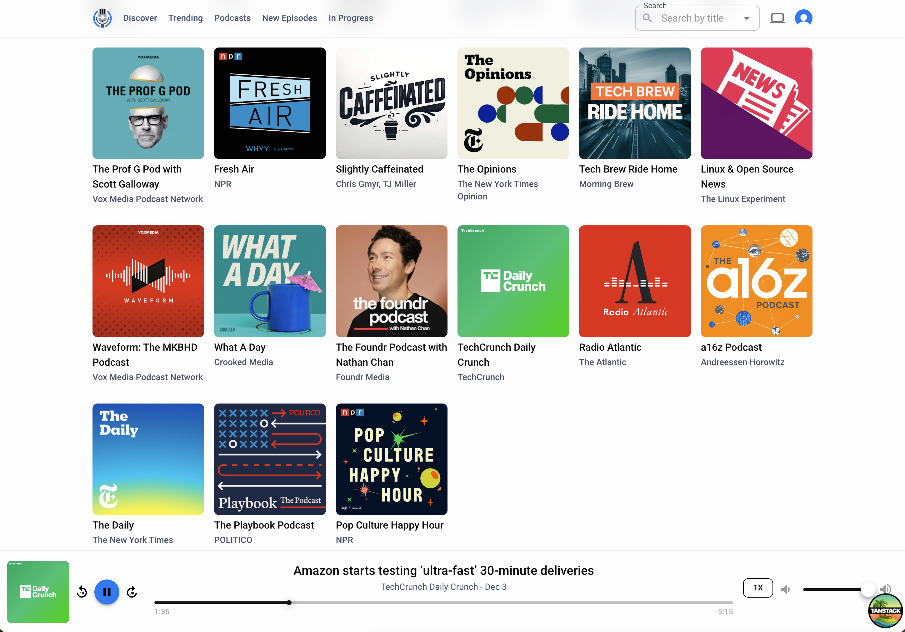
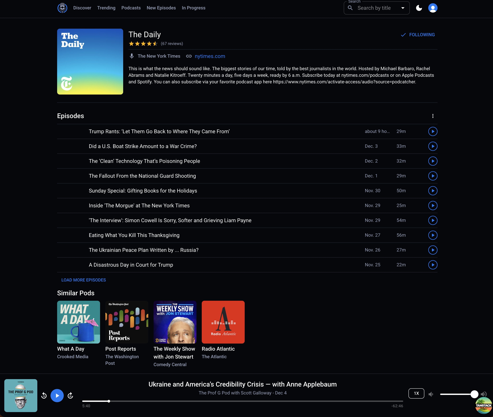
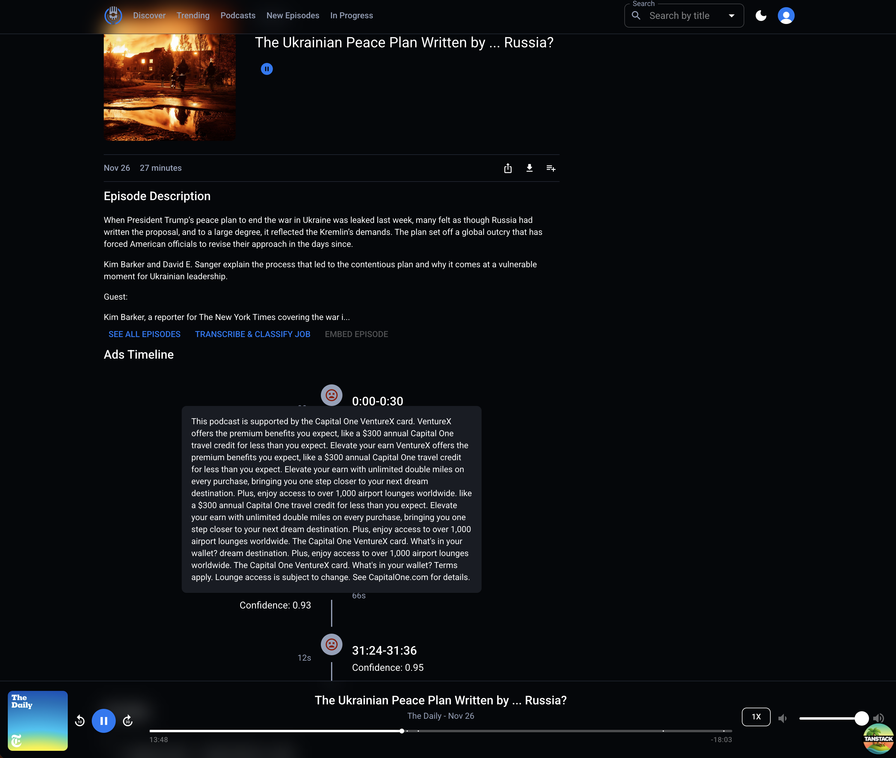
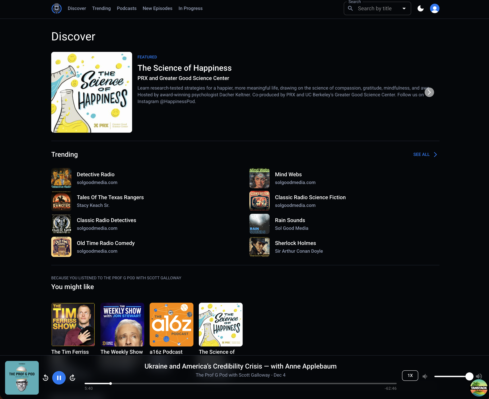

# Castaway Podcast App

## Directory Structure

TODO

## Development

See `.env.example` for required environment variables.

## Features

- subscribe
- queue
- trending / discovery
- notifications

---

## UI












---

## TODO

- skeleton suspense loading states
- feedback score for ad segments
- search ad segments with embedding before sending to classifier (only send if unsure whether segment is ad)
- subscription notifications
- Refactor to use [Convex workflows](https://www.convex.dev/components/workflow)
  - adPipeline
  - transcribe episode
  - import podcast ?
- global playback/user preferences (playback speed, notifications, etc.)
- fingerprint ad detection (repeated segments across episodes)
  - Use audio fingerprints (Chromaprint/AcoustID-like, or embeddings hashed + approximate nearest neighbors).
- Rule / heuristic based ad detection
  - RSS/episode chapter markers: many publishers include chapters or timestamps labeled “ad” or “sponsor” — parse first.
- Hybrid rule+ML multi-stage pipeline (recommended)
  - Stage 0: cheap metadata & heuristics (chapters, silence, VAD, standard positions) → candidate windows.
  - Stage 1: fingerprint lookup against known ads (fast) → immediate labels. and/or build vector table of known ad phrases ("this episode is sponsored by...", "use promo code", etc.)
    - alt route: search against ad vector table for known patterns
    - If cosine similarity is above threshold, mark as ad
    - Only for uncertain windows, call the LLM classifier
  - Stage 2: audio-embedding classifier on candidate windows (small model on CPU) → high recall.
  - Stage 3: if ambiguous, ASR + lightweight transcript classifier / rule matcher → resolve host-read language.
  - Stage 4: optionally send the very small set of ambiguous windows to an LLM/Human review for final decision.
- Use vector search for “ad speaker voice similarity”
  - ads often have:
    - different vocal rhythm
    - repeated brand-specific phrasing
    - host-read ads that sound similar across episodes
  - If we embed transcript text AND optionally speaker changes (via diarization), we can detect “similar-sounding” ad blocks across episodes.
- Use vector search to chunk ads across episodes
  - if we've processed 100 episodes, we likely have “ad clusters.”
  - You find:
    - recurrences of the SAME sponsor
    - similar mid-roll ad patterns
    - out-of-place segments
  - This helps:
    - Multi-episode ad detection
    - Automatically labeling new ads
    - Discovering previously unseen ads

| Task                               | Vector Helps? | How                             |
| ---------------------------------- | ------------- | ------------------------------- |
| Detect repeated sponsor phrases    | ✅            | Compare to known ad patterns    |
| Detect similar ads across episodes | ✅            | Clustering windows              |
| Reduce LLM calls                   | ⭐ HUGE       | Pre-filter windows              |
| Improve Convex speed               | ⭐ HIGH       | Less time inside jobs           |
| Auto-tag sponsors                  | 💡            | Nearest neighbor classification |
| Auto-detect ad start/end           | ⚠️ partial    | Useful as a signal              |

---

### Collections / tables

- `podcasts` - canonical podcast metadata

  ```json
  {
    "_id": "podcast:xxxxx",
    "feedUrl": "https://feeds.example.com/show.xml", // canonical feed URL
    "link": "https://podsite.com",
    "title": "The Daily",
    "description": "short blurb",
    "author": "New York Times",
    "imageUrl": "https://...",
    "itunesId": 12345, // if available
    "lastFetchedAt": 1699999999, // unix epoch ms
    "mostRecentEpisode": 20394809238, // ms
    "language": "en",
    "episodeCount": 2898,
    "categories": { "86": "news" },
    "categoryArray": ["news"],
    "explicit": false,
    "funding": {},
    "embedding": [0.23234, 0.3498] // TODO: delete ?? use convex rag component instead
  }
  ```

- `episodes` - canonical episode references (one doc per episode GUID)
  ```json
  {
    "_id": "episode:yyyy",
    "podcastId": "podcast:xxxxx",
    "guid": "<episode-guid-from-feed>",
    "title": "Episode Title",
    "publishedAt": 1699999999,
    "audioUrl": "https://cdn...",
    "durationSeconds": 3600,
    "sizeBytes": 12345678,
    "summary": "...",
    "enclosureType": "audio/mpeg",
    "retrievedAt": 1699999999,
    "feedUrl": "https://feed.com",
    "feedImage": "https://image.com",
    "feedItunesId": 12345,
    "summary": "description of episode",
    "enclosureType": "",
    "season": 2,
    "episode": 23,
    "episodeType": "full",
    "explicit": false,
    "language": "en",
    "retrievedAt": 10293809182,
    "embeddingId": "2l3k4-2l3kj4",
    "chaptersUrl": "https://chapters.com",
    "transcripts": [],
    "persons": [],
    "socialInteract": []
  }
  ```
  TODO: delete ?? use convex RAG component instead ??
- `episodeEmbedding` - vector embedding for episodes

  ```json
  {
    "episodeConvexId": "2l3k4j",
    "episodeGuid": "2lk34jl2k34j",
    "podcastId": "2l3k4j34",
    "embedding": [0.23345, 0.293847],
    "metadata": {
      "title": "Episode Title",
      "podcastTitle": "The Daily",
      "publishedAt": 20934098234,
      "duration": 8270
    },
    "createdAt": 29348002
  }
  ```

- `subscriptions` - user subscribes to a podcast

  ```json
  {
    "_id": "subscription:zzz",
    "userId": "user:abc",
    "podcastId": "podcast:xxxxx",
    "subscribedAt": 1699999999,
    "settings": {
      "autoDownload": false,
      "notificationNew": true,
      "sort": "newest"
    }
  }
  ```

- `user_playback` - per (user, episode) progress & state

  ```json
  {
    "_id": "0293848sslksdjfl",
    "userId": "clerkId",
    "episodeId": "episodeGuid",
    "positionSeconds": 120.5,
    "duration": 8920,
    "completed": false,
    "lastUpdatedAt": 1699999999,
    "playedPercentage": 0.033, // optional redundant field for UI fast-read
    "episodeTitle": "Ep Title",
    "podcastTitle": "Pod Title"
  }
  ```

- `ads` - ad segments

  ```json
  {
    "_id": "0293848sslksdjfl",
    "podcastId": "podGuid",
    "episodeId": "episodeGuid",
    "convexEpId": "convexId",
    "audioUrl": "https://episode.com",
    "start": 0,
    "end": 120,
    "duration": 120,
    "transcript": "The show is brought to you by...",
    "confidence": 0.9,
    "embedding": [0.234, 0.8374],
    "createdAt": 293840293849
  }
  ```

- `adJobs` - ad job workflow

  ```json
  {
    "_id": "0293848sslksdjfl",
    "episodeId": "episodeGuid",
    "audioUrl": "https://episodeAudio.com",
    "status": "transcribed",
    "createdAt": 9834573274,
    "completedAt": 2934809234,
    "transcript": "The show is brought to you by...",
    "segments": [
      {
        "start": 0,
        "end": 80,
        "duration": 80,
        "transcript": "The show is brought to you by...",
        "confidence": 0.9
      }
    ]
  }
  ```

- `adJobWindows` - ad job windows - intermediate step in workflow - sent to classifier before being stitched into ad segments if determined to be an ad

  ```json
  {
    "_id": "0293848sslksdjfl",
    "jobId": "convexId",
    "classified": true,
    "text": "transcript snippet",
    "start": 0,
    "end": 120,
    "is_ad": true,
    "confidence": 0.9,
    "reason": "promoting product"
  }
  ```

### Tables not implemented yet (TODO: playlist/queue features):

- `user_queues` - per-user queue (ordered list of items)
  - option A: queue as ordered list
    ```json
    {
      "_id": "queue:user:abc",
      "userId": "user:abc",
      "items": [
        { "episodeId": "episode:yyyy", "enqueuedAt": 1699999999, "id": "qi1" },
        { "episodeId": "episode:zzzz", "enqueuedAt": 1699999988, "id": "qi2" }
      ],
      "lastModifiedAt": 1699999999
    }
    ```
  - option B: queue as per-item documents (easier realtime & small updates)
    ```json
    {
      "_id": "queueItem:q1",
      "userId": "user:abc",
      "episodeId": "episode:yyyy",
      "positionIndex": 1000.0, // use float ordering technique
      "state": "queued" // queued|playing|played|removed
    }
    ```
  - recommend Option B for Convex (smaller write footprint and Convex realtime plays nicely with per-item updates).
- `user_devices` (optional) — register devices to push sync signals / presence:
  ```json
  {
    "_id": "device:dev1",
    "userId": "user:abc",
    "clientId": "web-xyz",
    "lastSeenAt": 1699999000
  }
  ```

### Subscribe flow

1. UI: user clicks “Subscribe” → client performs optimistic mutation:

2. Check if podcast already exists in DB, if not, add podcast to the `podcasts` table and `ctx.scheduler.runAfter(0, fetchEpisodes)` --> save `episodes` from Podcast Index.

3. add a `subscription` doc in Convex.

Idempotency: worker should upsert by GUID/enclosure URL — PodcastIndex and feeds sometimes change GUIDs; use a composite of feedUrl + episode GUID + publishedAt for safe dedupe.

### Queue background work

Convex is realtime & has server functions but is not a job scheduler. Use a small worker system:

Worker responsibilities:

Poll PodcastIndex for updated feeds (or receive webhooks if available).

Fetch feeds and normalize to your episodes collection.

Perform heavier tasks: waveform extraction, generate transcriptions, download/cache audio for offline, generate audio snippets/previews.

Throttle requests and obey robots/remote limits.

Implementation options:

Simple cron + worker: schedule a cloud cron job that enqueues feed IDs to process (Cloud Run + Pub/Sub, AWS EventBridge + Lambda, etc.).

Job queue for retries: use a queue library (BullMQ, RabbitMQ, or cloud queue) to manage retry/exponential backoff for failing feed pulls.

Push model: when a user subscribes, enqueue immediate fetchFeed job for that podcastId.

Why separate worker? Feed parsing and waveform/transcription are IO/CPU heavy and you don’t want the browser or Convex mutation to block on them. Convex is excellent for realtime syncing but not for heavy batch processing; use workers for robustness.

### Storing playback, progress, played state & syncing rules

_Data & write patterns_

Persist `user_playback` per episode (position + lastUpdatedAt). Writes are small and idempotent. Use `lastUpdatedAt` server timestamp to resolve conflicts (last-write-wins), or attach a `deviceClock` + sequence if you want better merges.

Persist `user_queues` as per-item docs (see above) so reordering is cheap (update one or two docs). Use floating indices (1000, 2000, 1500) so reorders avoid rewriting all items. When indices get dense, rebalance in the background.

TODO:
Mark an episode `completed` when `position >= duration * 0.95` (or when user presses “mark played”).

_Sync frontend_

Local immediate state: keep Howler play state (current Howl instance, `isPlaying`, `seek`) in ephemeral local state (React + Zustand or context). This is the real-time playback source of truth while the user is in the session.

Debounced persistence: every N seconds (e.g., 5–10s) while playing, write `user_playback.positionSeconds` to Convex (via TanStack Query mutation). [TODO:]Also write on pause/seek/stop and when the tab unloads. Debounce to coalesce writes; but write at least every 10s so progress is not lost. (If we want more robust offline, persist to IndexedDB then sync.)

Optimistic UI + TanStack Query: when the user seeks or marks completed, optimistically update the cached `user_playback/user_queues` using `onMutate` and rollback on error. Use `invalidateQueries/refetch` on settle if needed.

Realtime mirroring via Convex: subscribe to `user_playback` and `user_queues` queries so changes from other devices (or background jobs) push to the client in realtime. When a remote update comes in while the user is actively playing locally, prefer the local ephemeral Howler state and only apply remote updates if `lastUpdatedAt` is newer than the local last persisted timestamp. This prevents remote writes from stomping live playback

_Example play sync flow_

User opens device A and plays episode X. Howler plays, UI updates locally. Every 5–10s you write position to Convex.

User opens device B: Convex realtime query returns the latest `user_playback.positionSeconds`; device B can show the “resume from X” affordance. If device B auto-play, check timestamps and ask user to resume instead of auto-overwriting.

If devices both play, last-write-wins on `lastUpdatedAt`. You can reduce race window by making device writes fast and infrequent.

---

### HowlerJS specifics & integration tips

- Create one Howl instance per playing audio (or reuse single Howl and swap `src` depending on complexity). Howler defaults to Web Audio and falls back to HTML5 audio; resume/seek behavior differs by mode — ensure `html5` is set appropriately for long streams vs. short sounds.

- To resume playback from saved position: create Howl, then call `howl.seek(savedPosition)` before h`owl.play()`. If you see restarts, make sure html5 flag and buffering choices are appropriate (some browsers need html5: true for large files). See common Howler usage notes for resume.

- Handle `onplay`, `onseek`, `onpause`, `onend` callbacks to trigger your persistence (debounced writes). On `onend`, mark `completed` and increment “played” counts server-side.

- Preload next episode’s small portion (or preconnect) for seamless gapless playback: create a Howl for next item with `preload: true` (but be cautious with mobile data).

### [TODO:] Queue order & conflict resolution

- Use per-item `positionIndex` floats (like 1000,2000...). Reordering is update of one or two items instead of rewriting whole queue. If many concurrent edits happen, normalize indices in background job.

- For strict ordering across devices, implement a tiny server-side sequencing function: when a client requests to move item to top, call a Convex mutation that sets `positionIndex = getSmallestIndex() - 1000` (atomic on server) so you avoid read-modify-write races. Convex mutations are atomic so they help here.

### [TODO:] Offline support

Persist in IndexedDB (e.g., localforage) the ephemeral queue + latest playback timestamp. When back online, sync:

Push any local `user_playback` with the device timestamp.

For queue changes, send a batch mutation to Convex. Use `onMutate` and optimistic updates so UI remains snappy.

If you need robust offline-first (edits on many devices), consider a CRDT or a local DB (e.g., TanStack DB / Electric) — but for most podcast apps last-write-wins with timestamps + user reconciliation is acceptable. (If you want to explore local-first DB integrations, TanStack DB docs have patterns for local-first sync.)

## Ad Detection Implementation

### Transcribe

- Use model (openAI/AssemblyAI/Deepgram) to transcribe audio from url into transcript
  - break audio into chunks to abide by 25MB transcription limit (`convex/utils/transcribe.ts`)
  - merge transcripts and return as segments (`{ id: string;, start: number; end: number; text: string }[]`)
- Build windows
  - prep data for LLM by breaking into slightly overlapping windows of 10-20s
- Classify windows (`convex/utils/llmBatchClassifier.ts`)
  - call LLM with batches of windows (batch to save tokens / reduce cost)
  - prompt LLM to classify each window with the format: `{ id_ad: boolean, confidence: 0-1, reason: string }`
  - return array of combined windows with LLM classification response
- Merge windows (`convex/utils/mergeWindows.ts`)
  - use classification and confidence to identify ad segments
- Run convex action to save each ad to the ads table
  - calc embedding from ad segment transcript
  - format:
  ```json
  {
    "podcastId": "podcastGUID",
    "episodeId": "episodeGUID",
    "convexEpId": "Id<'episodes'>",
    "audioUrl": "https://somepod.com/episode/123/audio.mp3",
    "start": 800, // time seconds
    "end": 845, // time seconds
    "duration": 45, // seconds
    "transcript": "text",
    "confidence": 0.89,
    "embedding": [0.23, 0.2839]
  }
  ```

### Broken into multi-step flow to accommodate Convex limits

1. mutation -> create `adJobs` doc (audioUrl, podId, episodeId, status, createdAt)

- trigger process to process audio transcription

```typescript
// convex/adPipeline/start.ts
export const startAdDetection = mutation({
  args: {
    audioUrl: v.string(),
  },
  handler: async (ctx, { audioUrl }) => {
    const jobId = await ctx.db.insert('adJobs', {
      audioUrl,
      status: 'pending',
      createdAt: Date.now(),
    });

    // schedule next step
    await ctx.scheduler.runAfter(0, internal.adPipeline.transcribe.fn, {
      jobId,
    });

    return jobId;
  },
});
```

2. Transcribe audio

- `transcribeUrl` - breaks audio into chunks of <25MB --> openAI.transcribe --> combine & return transcript segments & text
- `transcribeEpisodeAndSaveTranscript` calls LLM again to generate summary & tags which are passed to Convex RAG component which will create embedding (`internal.rag.insertEpisodeTranscript`)

```typescript
// convex/adPipeline/transcribe.ts
export const fn = internalAction({
  args: { jobId: v.id('adJobs') },
  handler: async (ctx, { jobId }) => {
    const job = await ctx.runQuery(api.adJobs.getById, { id: jobId });
    // ... redacted for brevity
    const transcript = await transcribeUrl(job.audioUrl, {});
    const transcriptId = await ctx.runMutation(internal.transcripts.save, {
      episodeId: job.episodeId,
      audioUrl: job.audioUrl,
      fullText: transcript.text,
      segments: transcript.segments || [],
    });

    await ctx.runMutation(internal.adJobs.patch, {
      id: jobId,
      updates: { transcriptId, status: 'transcribed' },
    });

    await ctx.scheduler.runAfter(0, internal.adPipeline.chunkTranscript.fn, {
      jobId,
    });
  },
});
```

3. Chunk transcript

- `buildWindows` - combine segments into windows of X duration (12s) with overlap of Y duration (6s)
- save windows to DB to be processed by classifier

```typescript
// convex/adPipeline/chunkTranscript.ts
export const fn = internalMutation({
  args: { jobId: v.id('adJobs') },
  handler: async (ctx, { jobId }) => {
    // ... fetch job & transcript
    const windows = buildWindows(
      job.transcript?.segments || [],
      WINDOW_SIZE, // 12s
      WINDOW_OVERLAP // 4s
    );

    // store windows in DB
    for (const w of windows) {
      await ctx.db.insert('adJobWindows', {
        jobId,
        ...w,
        classified: false,
      });
    }

    // schedule classification batches
    await ctx.scheduler.runAfter(0, internal.adPipeline.classifyWindows.fn, {
      jobId,
    });
  },
});
```

4. Batch LLM classification (Convex Job)

- recursively classify X number of windows at a time to avoid convex action timeout
- once all windows have been marked as classified in DB --> continue to next step: merge segments

```typescript
// convex/adPipeline/classifyWindows.ts
export const fn = internalAction({
  args: { jobId: v.id('adJobs') },
  handler: async (ctx, { jobId }) => {
    const windows = await ctx.runQuery(internal.adJobs.getWindows, {
      jobId,
      classified: false,
      count: 20,
    });

    if (windows.length === 0) {
      await ctx.scheduler.runAfter(0, internal.adPipeline.mergeSegments.fn, {
        jobId,
      });
      return;
    }

    // TODO: check ad table for similar windows labelled as an ad ??
    // if high confidence --> label as ad or not ad ??

    // LLM call for the batch
    const classifiedWindows = await classifyWindowsBatch(windows);

    // write results
    await ctx.runMutation(internal.adJobs.patchWindows, {
      windows: classifiedWindows.map((w) => ({ ...w, classified: true })),
    });

    // schedule next batch
    await ctx.scheduler.runAfter(0, internal.adPipeline.classifyWindows.fn, {
      jobId,
    });
  },
});
```

5. Merge classified windows into ad segments

```typescript
// convex/adPipeline/mergeSegments.ts
export const fn = internalMutation({
  args: { jobId: v.id('adJobs') },
  handler: async (ctx, { jobId }) => {
    const windows = await ctx.db
      .query('adJobWindows')
      .withIndex('by_jobId_classified', (q) => q.eq('jobId', jobId))
      .collect();

    const segments = mergeAdWindows(
      windows as ClassifiedWindow[],
      MIN_SEGMENT_LENGTH, // 5s
      MERGE_GAP // 2s
    );

    await ctx.db.patch(jobId, {
      segments,
      status: 'classified',
    });

    await ctx.scheduler.runAfter(0, internal.adPipeline.saveToAds.fn, {
      jobId,
    });
  },
});
```

6. Save ad segments to `ads` table

```typescript
// convex/adPipeline/saveToAds.ts
export const fn = internalAction({
  args: { jobId: v.id('adJobs') },
  handler: async (ctx, { jobId }) => {
    const adJob = await ctx.runQuery(api.adJobs.getById, { id: jobId });

    const episode = await ctx.runQuery(api.episodes.getByGuid, {
      id: adJob.episodeId,
    });

    for (let segment of adJob.segments) {
      await ctx.runAction(internal.node.saveAdSegment, {
        episodeId: adJob.episodeId,
        podcastId: episode.podcastId,
        audioUrl: adJob.audioUrl,
        convexEpId: episode._id,
        start: segment.start,
        end: segment.end,
        transcript: segment.transcript,
        confidence: segment.confidence,
      });
    }

    await ctx.runMutation(internal.adJobs.patch, {
      id: jobId,
      updates: { status: 'complete', completedAt: Date.now() },
    });
  },
});
```

## Agent Chat/Search

## **3. Personalized Episode Highlights**

Use Agent Mode to:

- Analyze the transcript and detect “high-value moments”
- Generate:

  - quotes
  - takeaways
  - timestamps

- Store highlight cards

You can personalize based on user interests (stored in Convex).

---

## **4. AI Search Across All Podcasts**

Index transcripts with embeddings and store them in Convex.

Supports:

- “Find me episodes where they talk about self-driving cars”
- Cross-episode and cross-show semantic search
- Question answering over all transcript content

Convex Agent Mode can:

- Generate embeddings
- Build vector index entries
- Re-index periodically or incrementally

---

## **5. Ask Questions About an Episode (RAG)**

Users ask:

> “What did the guest say about remote work?”

Agent Mode retrieves transcript chunks and uses GPT to answer.

Workflow:

- Retrieve transcript (local or external)
- Chunk + embed
- Run retrieval
- Generate answer
- Return final result

## **7. Intelligent Recommendations**

Convex workflow:

- Process transcripts + metadata
- Build embeddings per episode
- Match to user profile embeddings
- Push new recommendations periodically

Types:

- “Because you liked hard-science episodes…”
- “Episodes similar to what you listened to today…”

---

## Agent Implementation

1. new episode is added

- create transcript using OpenAI whisper
- save transcript to DB (used for ad detection)

2. RAG

- pass to Convex's agent for RAG [docs](https://docs.convex.dev/agents/rag)
- calc transcript summary instead of embedding entire transcript? (title + description + transcript summary)
  - how Convex agent filter/namespace by episode ??

3. Recommendations

- occasionally compute user taste vector (cron) & save to user doc

```typescript
ctx.db
  .query('podcastEpisodes')
  .withVectorIndex('by_embedding', (q) => q.near(userEmbedding, { limit: 20 }));
```

TODO: currently saving episode embeddings to `episodeEmbeddings` table & passing to RAG agent component

### Chat

- create a new thread
- updateThreadTitle tool summarizes the query to create title
- Agent can be scoped to specific podcast/episode for search (use tool ??)

---

# ✅ **User-Facing AI Features You Can Build Using Convex Agent Mode**

Agent Mode lets you run long-running, multi-step workflows that call external APIs and update Convex database state. That’s perfect for podcast intelligence features that require background processing, enrichment, or periodic updates.

---

## **1. Automatic Episode Summaries**

When a new episode is published:

- The agent fetches audio
- Transcribes it (Whisper API)
- Summarizes it (GPT model)
- Stores the summary in your Convex database

Use cases:

- “What’s this episode about?” quickly shows an AI-generated synopsis.
- Generate multiple summary lengths: 1-sentence, 1-paragraph, bullet points.

**Agent Mode is ideal** because transcription + summarization may take multiple minutes and involve several API calls.

---

## **2. Chapter Generation / Topic Segmentation**

TODO: can this be done with same token cost as classifyAds ??

Agent workflow:

1. Transcribe the episode
2. Segment transcript based on topic embeddings
3. Generate chapter titles
4. Save them for the client app UI

Result: Users can jump to sections like _“Interview begins”_, _“Key takeaway #3”_, etc.

---

## **3. Personalized Episode Highlights**

Use Agent Mode to:

- Analyze the transcript and detect “high-value moments”
- Generate:

  - quotes
  - takeaways
  - timestamps

- Store highlight cards

You can personalize based on user interests (stored in Convex).

---

## **4. AI Search Across All Podcasts**

Index transcripts with embeddings and store them in Convex.

Supports:

- “Find me episodes where they talk about self-driving cars”
- Cross-episode and cross-show semantic search
- Question answering over all transcript content

Convex Agent Mode can:

- Generate embeddings
- Build vector index entries
- Re-index periodically or incrementally

---

## **5. Ask Questions About an Episode (RAG)**

Users ask:

> “What did the guest say about remote work?”

Agent Mode retrieves transcript chunks and uses GPT to answer.

Workflow:

- Retrieve transcript (local or external)
- Chunk + embed
- Run retrieval
- Generate answer
- Return final result

---

## **6. AI Playback Features**

### Real-time or pre-computed:

- “Explain this topic at a beginner level”
- “Give me context about this reference”
- “Summarize the last 5 minutes”
- “Translate this episode”

Agent Mode can generate segment-by-segment contextual notes.

---

## **7. Intelligent Recommendations**

Convex workflow:

- Process transcripts + metadata
- Build embeddings per episode
- Match to user profile embeddings
- Push new recommendations periodically

Types:

- “Because you liked hard-science episodes…”
- “Episodes similar to what you listened to today…”

---

## **8. Auto-Generated Episode Notes / Newsletters**

Agent Mode can:

- Monitor new episode releases from RSS
- Generate:

  - show notes
  - bullet summary
  - newsletter blurb

- Store in Convex
- Push to your email pipeline / social posts

This allows creators using your app to _automatically get polished episode notes_.

---

# 🚀 **Backend / Operational Features via Agent Mode**

## **9. Smart RSS & Feed Monitoring Agents**

Agents can:

- Monitor podcast feeds on schedules
- Detect new episodes
- Fetch audio + metadata
- Trigger downstream tasks like transcription

Good for maintaining fully-updated episode catalogs without manual intervention.

---

## **10. Automated Content Moderation or Classification**

Useful if users upload their own podcasts.

Agents can:

- Classify episodes by category (tech, politics, comedy…)
- Detect content flags
- Auto-label episodes for browsing / filtering

---

## **11. Multi-Step Publishing Workflow for Podcasters**

If your app serves podcast creators:

- Upload → transcription → cleanup → summary → show notes → social posts
- The whole pipeline can run as an Agent Mode workflow.

Pods upload once; everything else happens automatically.

---

# 🔧 **Why Convex Agent Mode Fits Podcast Workflows So Well**

Podcast features often require:

- **Long-running jobs** (transcription, indexing)
- **Chained API calls** (Whisper → GPT → embeddings → storage)
- **Background tasks** (feed monitoring, recommendations)
- **Updating the Convex DB progressively** (progress indicators, partial results)

Agent Mode provides:

- long-running durable workers
- native state ←→ worker interaction
- API integrations
- reliable workflows with automatic retries

So it maps naturally onto audio processing.
