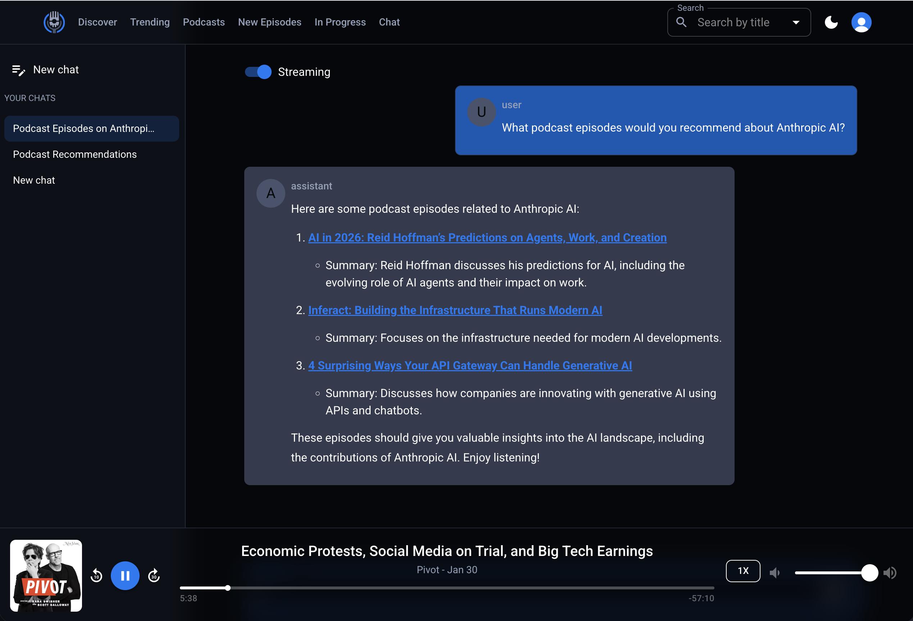

# Castaway Podcast App

## Features

- subscribe to podcasts
- transcribe episodes
- identify ads
- personalized recommendations (vector search)
- trending / discovery
- AI chat with RAG tooling

---

## UI

---

## Development

See [DEVELOPMENT.md](docs/DEVEOPMENT.md) for details

## Deployment

See [DEPLOYMENT.md](docs/DEPLOYMENT.md) for details

## TODO

- feedback score for ad segments
- search ad segments with embedding before sending to classifier (only send if unsure whether segment is ad)
- subscription notifications
- global playback/user preferences (playback speed, notifications, etc.)
- fingerprint ad detection (repeated segments across episodes)
    - Use audio fingerprints (Chromaprint/AcoustID-like, or embeddings hashed + approximate nearest neighbors).
- Rule / heuristic based ad detection
    - RSS/episode chapter markers: some publishers include chapters or timestamps labeled “ad” or “sponsor” — parse first.
- Hybrid rule + ML multi-stage pipeline
    - Stage 0: cheap metadata & heuristics (chapters, silence, VAD, standard positions) → candidate windows.
    - Stage 1: fingerprint lookup against known ads (fast) → immediate labels. and/or build vector table of known ad phrases ("this episode is sponsored by...", "use promo code", etc.)
        - alt route: search against ad vector table for known patterns
        - If cosine similarity is above threshold, mark as ad
        - Only for uncertain windows, call the LLM classifier
    - Stage 2: audio-embedding classifier on candidate windows (small model on CPU) → high recall.
    - Stage 3: if ambiguous, ASR + lightweight transcript classifier / rule matcher → resolve host-read language.
    - Stage 4: optionally send the very small set of ambiguous windows to an LLM/Human review for final decision.
- Use vector search for “ad speaker voice similarity”
    - ads often have:
        - different vocal rhythm
        - repeated brand-specific phrasing
        - host-read ads that sound similar across episodes
    - If we embed transcript text AND optionally speaker changes (via diarization), we can detect “similar-sounding” ad blocks across episodes.
- Use vector search to chunk ads across episodes
    - if we've processed 100 episodes, we likely have “ad clusters.”
    - find:
        - recurrences of the SAME sponsor
        - similar mid-roll ad patterns
        - out-of-place segments
    - This helps:
        - Multi-episode ad detection
        - Automatically labeling new ads
        - Discovering previously unseen ads

<!-- | Task                               | Vector Helps? | How                             |
| ---------------------------------- | ------------- | ------------------------------- |
| Detect repeated sponsor phrases    | ✅            | Compare to known ad patterns    |
| Detect similar ads across episodes | ✅            | Clustering windows              |
| Reduce LLM calls                   | ⭐ HUGE       | Pre-filter windows              |
| Improve Convex speed               | ⭐ HIGH       | Less time inside jobs           |
| Auto-tag sponsors                  | 💡            | Nearest neighbor classification |
| Auto-detect ad start/end           | ⚠️ partial    | Useful as a signal              | -->

<!--
## **4. AI Search Across All Podcasts**

Index transcripts with embeddings and store them in Convex.

Supports:

- “Find me episodes where they talk about self-driving cars”
- Cross-episode and cross-show semantic search
- Question answering over all transcript content

Convex Agent Mode can:

- Generate embeddings
- Build vector index entries
- Re-index periodically or incrementally

---

## **5. Ask Questions About an Episode (RAG)**

Users ask:

> “What did the guest say about remote work?”

Agent Mode retrieves transcript chunks and uses GPT to answer.

Workflow:

- Retrieve transcript (local or external)
- Chunk + embed
- Run retrieval
- Generate answer
- Return final result

## **7. Intelligent Recommendations**

TODO: switch to use RAG component so we're not duplicating embeddings

Convex workflow:

- Process transcripts + metadata
- Build embeddings per episode
- Match to user profile embeddings
- Push new recommendations periodically

Types:

- “Because you liked hard-science episodes…”
- “Episodes similar to what you listened to today…” -->
