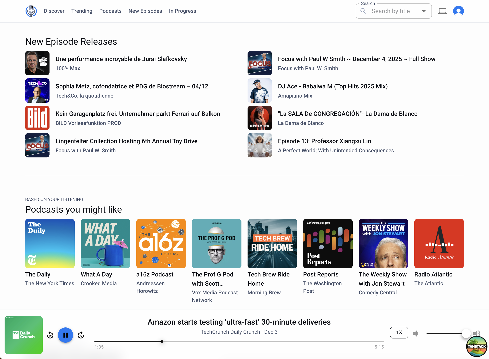
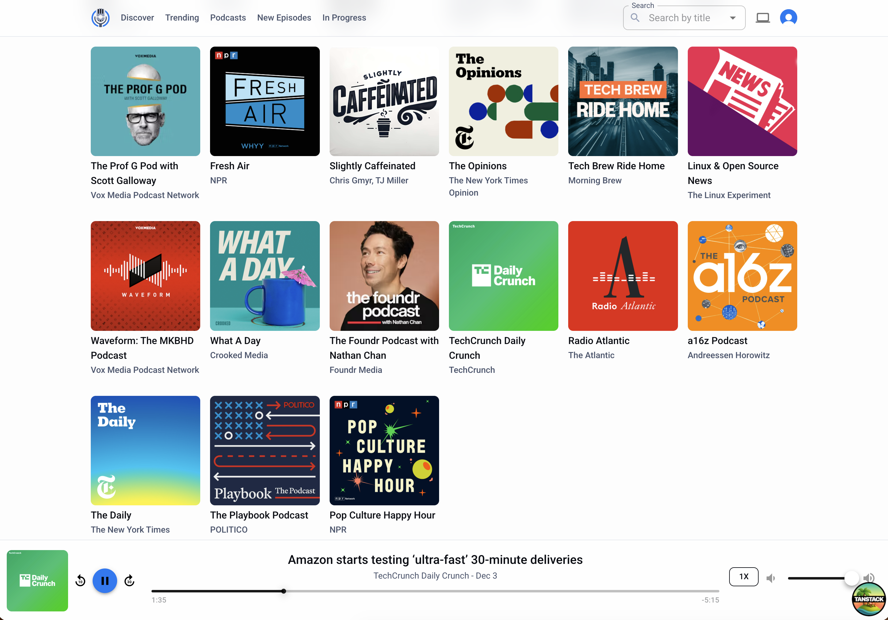
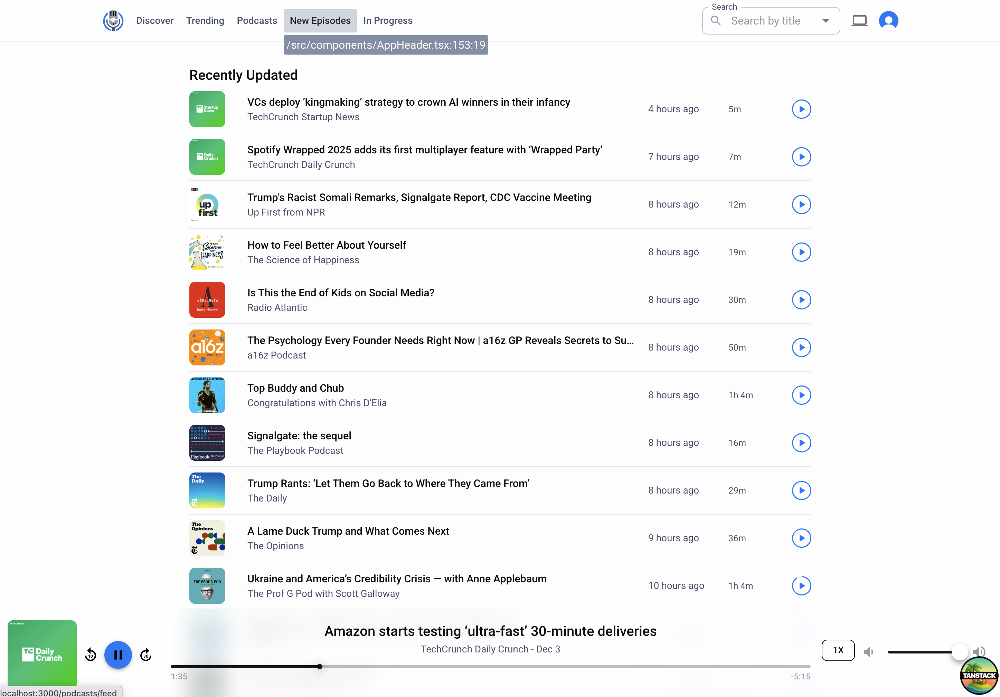
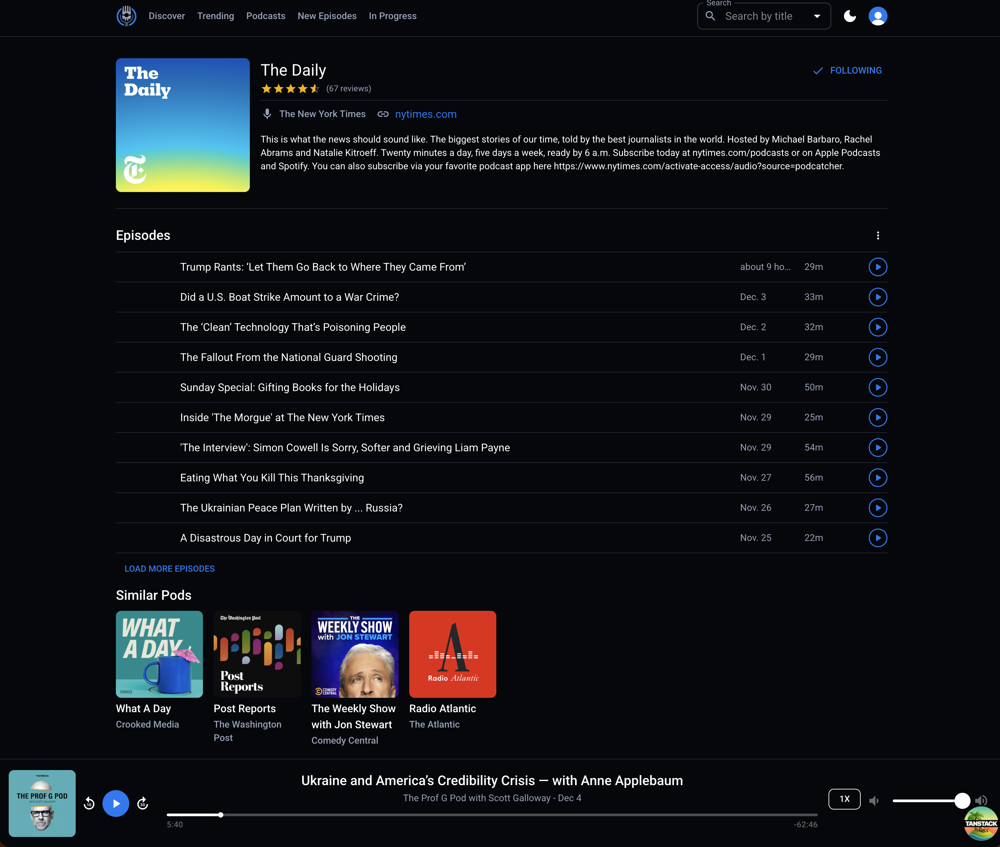
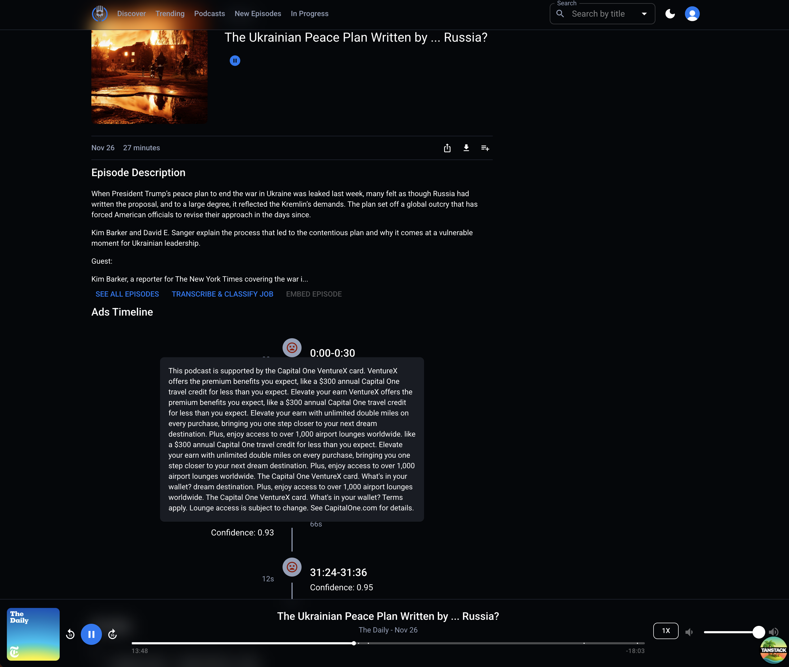
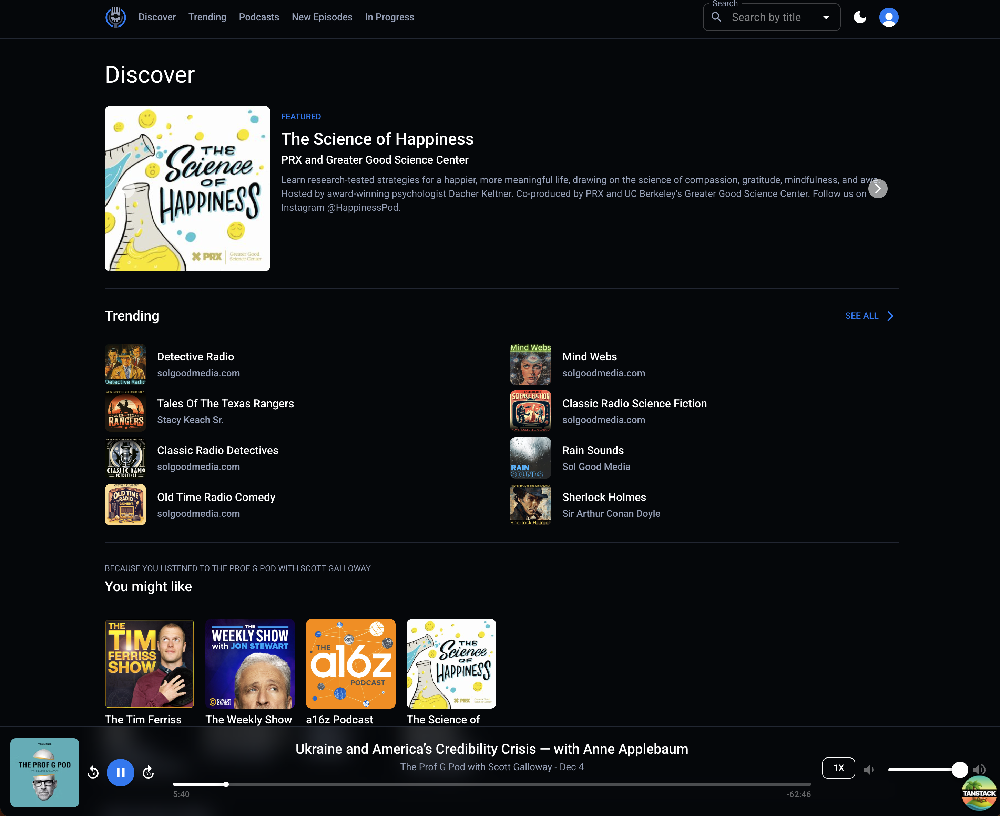

# Castaway Podcast App

## Directory Structure

TODO

## Development

See `.env.example` for required environment variables.

## Features

- subscribe
- queue
- trending / discovery
- notifications

---

## UI













---

## TODO

- skeleton suspense loading states
- feedback score for ad segments
- search ad segments with embedding before sending to classifier (only send if unsure whether segment is ad)
- subscription notifications
- Refactor to use [Convex workflows](https://www.convex.dev/components/workflow)
  - adPipeline
  - transcribe episode
  - import podcast ?
- global playback/user preferences (playback speed, notifications, etc.)
- fingerprint ad detection (repeated segments across episodes)
  - Use audio fingerprints (Chromaprint/AcoustID-like, or embeddings hashed + approximate nearest neighbors).
- Rule / heuristic based ad detection
  - RSS/episode chapter markers: many publishers include chapters or timestamps labeled “ad” or “sponsor” — parse first.
- Hybrid rule+ML multi-stage pipeline (recommended)
  - Stage 0: cheap metadata & heuristics (chapters, silence, VAD, standard positions) → candidate windows.
  - Stage 1: fingerprint lookup against known ads (fast) → immediate labels. and/or build vector table of known ad phrases ("this episode is sponsored by...", "use promo code", etc.)
    - alt route: search against ad vector table for known patterns
    - If cosine similarity is above threshold, mark as ad
    - Only for uncertain windows, call the LLM classifier
  - Stage 2: audio-embedding classifier on candidate windows (small model on CPU) → high recall.
  - Stage 3: if ambiguous, ASR + lightweight transcript classifier / rule matcher → resolve host-read language.
  - Stage 4: optionally send the very small set of ambiguous windows to an LLM/Human review for final decision.
- Use vector search for “ad speaker voice similarity”
  - ads often have:
    - different vocal rhythm
    - repeated brand-specific phrasing
    - host-read ads that sound similar across episodes
  - If we embed transcript text AND optionally speaker changes (via diarization), we can detect “similar-sounding” ad blocks across episodes.
- Use vector search to chunk ads across episodes
  - if we've processed 100 episodes, we likely have “ad clusters.”
  - You find:
    - recurrences of the SAME sponsor
    - similar mid-roll ad patterns
    - out-of-place segments
  - This helps:
    - Multi-episode ad detection
    - Automatically labeling new ads
    - Discovering previously unseen ads

| Task                               | Vector Helps? | How                             |
| ---------------------------------- | ------------- | ------------------------------- |
| Detect repeated sponsor phrases    | ✅            | Compare to known ad patterns    |
| Detect similar ads across episodes | ✅            | Clustering windows              |
| Reduce LLM calls                   | ⭐ HUGE       | Pre-filter windows              |
| Improve Convex speed               | ⭐ HIGH       | Less time inside jobs           |
| Auto-tag sponsors                  | 💡            | Nearest neighbor classification |
| Auto-detect ad start/end           | ⚠️ partial    | Useful as a signal              |

---

### Collections / tables

See `convex/schema.tsx` for up to date schemas.

- `podcasts` - canonical podcast metadata

  ```json
  {
    "_id": "convexId",
    "feedUrl": "https://feeds.example.com/show.xml", // canonical feed URL
    "link": "https://podsite.com",
    "title": "The Daily",
    "description": "short blurb",
    "author": "New York Times",
    "ownerName": "The New York Times",
    "imageUrl": "https://...",
    "itunesId": 12345, // if available
    "lastFetchedAt": 1699999999, // unix epoch ms
    "mostRecentEpisode": 20394809238, // ms of most recent episode publishedAt
    "language": "en",
    "episodeCount": 2898,
    "categories": { "86": "news" },
    "categoryArray": ["news"],
    "explicit": false,
    "funding": {},
    "embedding": [0.23234, 0.3498] // TODO: delete ?? use convex rag component instead
  }
  ```

- `episodes` - canonical episode references (one doc per episode GUID)

  ```json
  {
    "_id": "episode:yyyy",
    "podcastId": "podcast:xxxxx",
    "guid": "<episode-guid-from-feed>",
    "title": "Episode Title",
    "publishedAt": 1699999999,
    "audioUrl": "https://cdn...",
    "durationSeconds": 3600,
    "sizeBytes": 12345678,
    "summary": "...",
    "enclosureType": "audio/mpeg",
    "retrievedAt": 1699999999,
    "feedUrl": "https://feed.com",
    "feedImage": "https://image.com",
    "feedItunesId": 12345,
    "summary": "description of episode",
    "enclosureType": "",
    "season": 2,
    "episode": 23,
    "episodeType": "full",
    "explicit": false,
    "language": "en",
    "retrievedAt": 10293809182,
    "embeddingId": "2l3k4-2l3kj4",
    "chaptersUrl": "https://chapters.com",
    "transcripts": [],
    "persons": [],
    "socialInteract": [],
    // LLM generated data
    "summaryTitle": "AI generated title",
    "oneSentenceSummary": "AI gen short summary",
    "detailedSummary": "AI gen detail summary",
    "keyTopics": ["AI topic"],
    "notableQuotes": ["quote 1", "quote 2"]
  }
  ```

  TODO: delete ?? use convex RAG component instead ??

- `episodeEmbedding` - vector embedding for episodes. Added by `episodes.ts -> saveEpisodes() --> episodeEmbeddings.ts -> embedNewEpisodes()` when a new episode is saved to DB.

  ```json
  {
    "episodeConvexId": "2l3k4j",
    "episodeGuid": "2lk34jl2k34j",
    "podcastId": "2l3k4j34",
    "embedding": [0.23345, 0.293847],
    "metadata": {
      "title": "Episode Title",
      "podcastTitle": "The Daily",
      "publishedAt": 20934098234,
      "duration": 8270
    },
    "createdAt": 29348002
  }
  ```

- `subscriptions` - user subscribes to a podcast

  ```json
  {
    "_id": "convexId",
    "clerkId": "userClerkId",
    "itunesId": 209384234,
    "podcastId": "2kl3j4-2kjoier-089dff8", // guid
    "subscribedAt": 92384092834,
    "autoDownload": false,
    "notificationNew": false,
    "podConvexId": "convexId"
  }
  ```

- `user_playback` - per (user, episode) progress & state

  ```json
  {
    "_id": "0293848sslksdjfl",
    "clerkId": "clerkId",
    "episodeId": "episodeGuid",
    "podcastId": "podGuid",
    "positionSeconds": 120.5,
    "duration": 8920,
    "completed": false,
    "lastUpdatedAt": 1699999999,
    "playedPercentage": 0.033, // optional redundant field for UI fast-read
    "episodeTitle": "Ep Title",
    "podcastTitle": "Pod Title"
  }
  ```

- `transcripts` -

  ```json
  {
    "_id": "0293848sslksdjfl",
    "episodeId": "episodeGuid",
    "audioUrl": "https://xyz.com",
    "fullText": "LLM generated transcript",
    "segments": [
      {
        "id": "209384",
        "start": 356.6774,
        "end": 385.29034,
        "text": "Segment snippet"
      }
    ],
    "summaryTitle": "LLM generated title",
    "oneSentenceSummary": "LLM generated short summary",
    "detailedSummary": "LLM generated detailed summary",
    "keyTopics": ["LLM generated topic"],
    "notableQuotes": ["LLM extracted quote"],
    "createdAt": 29034802834
  }
  ```

- `ads` - ad segments generated by the ad detection workflow (`convex/adPipeline`)

  ```json
  {
    "_id": "0293848sslksdjfl",
    "podcastId": "podGuid",
    "episodeId": "episodeGuid",
    "convexEpId": "convexId",
    "audioUrl": "https://episode.com",
    "start": 0,
    "end": 120,
    "duration": 120,
    "transcript": "The show is brought to you by...",
    "confidence": 0.9,
    "embedding": [0.234, 0.8374],
    "createdAt": 293840293849
  }
  ```

- `adJobs` - ad job to track workflow

  ```json
  {
    "_id": "0293848sslksdjfl",
    "episodeId": "episodeGuid",
    "audioUrl": "https://episodeAudio.com",
    "status": "transcribed",
    "createdAt": 9834573274,
    "completedAt": 2934809234,
    "transcript": "The show is brought to you by...",
    "segments": [
      {
        "start": 0,
        "end": 80,
        "duration": 80,
        "transcript": "The show is brought to you by...",
        "confidence": 0.9
      }
    ]
  }
  ```

- `adJobWindows` - ad job windows - intermediate step in workflow - sent to classifier before being stitched into ad segments if determined to be an ad

  ```json
  {
    "_id": "0293848sslksdjfl",
    "jobId": "convexId",
    "classified": true,
    "text": "transcript snippet",
    "start": 0,
    "end": 120,
    "is_ad": true,
    "confidence": 0.9,
    "reason": "promoting product"
  }
  ```

- `podcastStats` - aggregate table for querying podcasts based on aggregate data ([convex aggregates](https://www.convex.dev/components/aggregate))

  ```json
  {
    "_id": "0293848sslksdjfl",
    "podcastId": "podcastGuid",
    "playCount": 86,
    "updatedAt": 29034823423
  }
  ```

- `episodeStats` - aggregate table for querying episode data ([convex aggregates](https://www.convex.dev/components/aggregate))

  ```json
  {
    "_id": "0293848sslksdjfl",
    "episodeId": "episodeGuid",
    "podcastId": "podGuid",
    "playCount": 34,
    "updatedAt": 8934798374
  }
  ```

- `rawUsage` - record LLM usage in chat feature

  ```json
  {
    "_id": "0293848sslksdjfl",
    "userId": "clerkId",
    "agentName": "chatgpt-40",
    "model": "chatgpt-40",
    "provider": "",
    "usage": {},
    "providerMetadata": {},
    "billingPeriod": ""
  }
  ```

- `rawUsage` - calc billing from `rawUsage` in cron job

  ```json
  {
    "_id": "0293848sslksdjfl",
    "userId": "clerkId",
    "billingPeriod": "",
    "amount": 2.75,
    "status": "pending"
  }
  ```

### Tables not implemented yet (TODO: playlist/queue features):

- `user_queues` - per-user queue (ordered list of items)
  - option A: queue as ordered list
    ```json
    {
      "_id": "queue:user:abc",
      "userId": "user:abc",
      "items": [
        { "episodeId": "episode:yyyy", "enqueuedAt": 1699999999, "id": "qi1" },
        { "episodeId": "episode:zzzz", "enqueuedAt": 1699999988, "id": "qi2" }
      ],
      "lastModifiedAt": 1699999999
    }
    ```
  - option B: queue as per-item documents (easier realtime & small updates)
    ```json
    {
      "_id": "queueItem:q1",
      "userId": "user:abc",
      "episodeId": "episode:yyyy",
      "positionIndex": 1000.0, // use float ordering technique
      "state": "queued" // queued|playing|played|removed
    }
    ```
  - recommend Option B for Convex (smaller write footprint and Convex realtime plays nicely with per-item updates).
- `user_devices` (optional) — register devices to push sync signals / presence:
  ```json
  {
    "_id": "device:dev1",
    "userId": "user:abc",
    "clientId": "web-xyz",
    "lastSeenAt": 1699999000
  }
  ```

### Subscribe flow

1. UI: user clicks “Subscribe” → client performs optimistic mutation:

2. Check if podcast already exists in DB, if not, add podcast to the `podcasts` table and `ctx.scheduler.runAfter(0, fetchEpisodes)` --> save `episodes` from Podcast Index.

3. add a `subscription` doc in Convex.

### Storing playback, progress, played state & syncing rules

_Data & write patterns_

Persist `user_playback` per episode (position + lastUpdatedAt). Writes are small and idempotent. Use `lastUpdatedAt` server timestamp to resolve conflicts (last-write-wins), or attach a `deviceClock` + sequence if you want better merges.

Persist `user_queues` as per-item docs (see above) so reordering is cheap (update one or two docs). Use floating indices (1000, 2000, 1500) so reorders avoid rewriting all items. When indices get dense, rebalance in the background.

TODO:
Mark an episode `completed` when `position >= duration * 0.95` (or when user presses “mark played”).

_Sync frontend_

Local immediate state: keep Howler play state (current Howl instance, `isPlaying`, `seek`) in ephemeral local state (React + Zustand or context). This is the real-time playback source of truth while the user is in the session.

Debounced persistence: every N seconds (e.g., 5–10s) while playing, write `user_playback.positionSeconds` to Convex (via TanStack Query mutation). [TODO:]Also write on pause/seek/stop and when the tab unloads. Debounce to coalesce writes; but write at least every 10s so progress is not lost. (If we want more robust offline, persist to IndexedDB then sync.)

Optimistic UI + TanStack Query: when the user seeks or marks completed, optimistically update the cached `user_playback/user_queues` using `onMutate` and rollback on error. Use `invalidateQueries/refetch` on settle if needed.

Realtime mirroring via Convex: subscribe to `user_playback` and `user_queues` queries so changes from other devices (or background jobs) push to the client in realtime. When a remote update comes in while the user is actively playing locally, prefer the local ephemeral Howler state and only apply remote updates if `lastUpdatedAt` is newer than the local last persisted timestamp. This prevents remote writes from stomping live playback

_Example play sync flow_

User opens device A and plays episode X. Howler plays, UI updates locally. Every 5–10s you write position to Convex.

User opens device B: Convex realtime query returns the latest `user_playback.positionSeconds`; device B can show the “resume from X” affordance. If device B auto-play, check timestamps and ask user to resume instead of auto-overwriting.

If devices both play, last-write-wins on `lastUpdatedAt`. You can reduce race window by making device writes fast and infrequent.

---

### HowlerJS specifics & integration tips

- Create one Howl instance per playing audio (or reuse single Howl and swap `src` depending on complexity). Howler defaults to Web Audio and falls back to HTML5 audio; resume/seek behavior differs by mode — ensure `html5` is set appropriately for long streams vs. short sounds.

- To resume playback from saved position: create Howl, then call `howl.seek(savedPosition)` before `howl.play()`. If you see restarts, make sure html5 flag and buffering choices are appropriate (some browsers need html5: true for large files). See common Howler usage notes for resume.

- Handle `onplay`, `onseek`, `onpause`, `onend` callbacks to trigger your persistence (debounced writes). On `onend`, mark `completed` and increment “played” counts server-side.

- TODO: Preload next episode’s small portion (or preconnect) for seamless gapless playback: create a Howl for next item with `preload: true` (but be cautious with mobile data).

### [TODO:] Queue order & conflict resolution

- Use per-item `positionIndex` floats (like 1000,2000...). Reordering is update of one or two items instead of rewriting whole queue. If many concurrent edits happen, normalize indices in background job.

- For strict ordering across devices, implement a tiny server-side sequencing function: when a client requests to move item to top, call a Convex mutation that sets `positionIndex = getSmallestIndex() - 1000` (atomic on server) so you avoid read-modify-write races. Convex mutations are atomic so they help here.

### [TODO:] Offline support

Persist in IndexedDB (e.g., localforage) the ephemeral queue + latest playback timestamp. When back online, sync:

Push any local `user_playback` with the device timestamp.

For queue changes, send a batch mutation to Convex. Use `onMutate` and optimistic updates so UI remains snappy.

If you need robust offline-first (edits on many devices), consider a CRDT or a local DB (e.g., TanStack DB / Electric) — but for most podcast apps last-write-wins with timestamps + user reconciliation is acceptable. (If you want to explore local-first DB integrations, TanStack DB docs have patterns for local-first sync.)

---

## Ad Detection Implementation

### Transcribe

- Use model (openAI/AssemblyAI/Deepgram) to transcribe audio from url into transcript
  - break audio into chunks to abide by 25MB transcription limit (`convex/utils/transcribe.ts`)
  - merge transcripts and return as segments (`{ id: string;, start: number; end: number; text: string }[]`)
- Build windows
  - prep data for LLM by breaking into slightly overlapping windows of 10-20s
- Classify windows (`convex/utils/llmBatchClassifier.ts`)
  - call LLM with batches of windows (batch to save tokens / reduce cost)
  - prompt LLM to classify each window with the format: `{ id_ad: boolean, confidence: 0-1, reason: string }`
  - return array of combined windows with LLM classification response
- Merge windows (`convex/utils/mergeWindows.ts`)
  - use classification and confidence to identify ad segments
- Run convex action to save each ad to the ads table
  - calc embedding from ad segment transcript
  - format:
  ```json
  {
    "podcastId": "podcastGUID",
    "episodeId": "episodeGUID",
    "convexEpId": "Id<'episodes'>",
    "audioUrl": "https://somepod.com/episode/123/audio.mp3",
    "start": 800, // time seconds
    "end": 845, // time seconds
    "duration": 45, // seconds
    "transcript": "text",
    "confidence": 0.89,
    "embedding": [0.23, 0.2839]
  }
  ```

### Transcribe Convex Workflow

- `convex/transcriptWorkflow.ts` - transcribe episode
  1. break audio into segments and send to llm to transcribe (25MB data size limit) & save transcript to convex db (`transcripts` table)
  2. pass transcript to LLM to generate summary, key topics, notable quotes, etc.
  3. save to convex RAG component (for LLM tool, search, etc.)

### Ad Detection Convex Workflow

- `convex/adPipeline` - workflow to transcribe episode and identify ad segments
  1. create `adJobs` doc to track process
  2. trigger transcribe workflow (outlined above) - will use existing transcript if exists
  3. break transcript into slightly overlapping windows for classification (saved to `adJobWindows` table) (`convex/adPipeline/chunkTranscript`)
  4. recursively classify windows in batches (openAI with prompt to return boolean, confidence, reason) (`convex/adPipeline/classifyWindows`)
  5. stitch together windows identified as ads into ad segments (`convex/adPipeline/mergeSegments`)
  6. create embedding and save ad segments to `ads` table

## AI Chat/Search

LLM/Rag is used for the following features:

- chat with RAG context to include podcast and episode data
- podcast scoped episode search
- personalized episode and podcast recommendations

### Tools

The following tools are passed to the Agent so they can be used for context/RAG within the chat

- `searchEpisodes` - uses embeddings from LLM generated summary/topics to retrieve episodes semantically matching user's query
- `updateThreadTitle` - have LLM generate a title for the thread based on the message context

### RAG

[Convex RAG component](https://www.convex.dev/components/rag) stores episode and podcast embeddings.

### Chat

[Convex agent](https://docs.convex.dev/agents) is utilized for the chat implementation. See `convex/agent` folder.

### Vector-based recommendations/search

TODO: occasionally compute user taste vector (cron) & save to user doc

- personalized recommendations
  - podcasts (`convex/podcasts.ts`)
    - `getSimilarPodcasts()` - vector search `podcasts` table for semantically similar podcasts (matching summary/topics)
    - `getPersonalizedRecommendations()` - calc average vector from all of the podcasts that the user is following -> vector search the `podcasts` table
  - episodes (`convex/episodeEmbeddings.ts`)
    - `getSimilarEpisodes()` - vector search `episodeEmbeddings` for similar episodes
    - `getPersonalizedRecommendations()` - calc average vector from user's played episodes -> vector search `episodeEmbeddings` table for similar episodes

---

## Aggregates

[Convex aggregates](https://www.convex.dev/components/aggregate) component is added for episode and podcast stats in order to accomplish queries like _most played_ efficiently. See `convex/stats` and `convex/aggregates`.

---

```typescript
ctx.db
  .query('podcastEpisodes')
  .withVectorIndex('by_embedding', (q) => q.near(userEmbedding, { limit: 20 }));
```

TODO: currently saving episode embeddings to `episodeEmbeddings` table & passing to RAG agent component

---

## Auth

Clerk is used for auth.

Links

- [Clerk Tanstack SDK](https://clerk.com/docs/tanstack-react-start/getting-started/quickstart)
- [Clerk & Convex](https://clerk.com/docs/guides/development/integrations/databases/convex)
- [Convex & Clerk](https://docs.convex.dev/auth/clerk)
- [Convex & Tanstack Query](https://docs.convex.dev/client/tanstack/tanstack-query/)
- [Customize Components](https://clerk.com/docs/guides/customizing-clerk/overview)
- [Clerk webhooks](https://clerk.com/docs/guides/development/webhooks/overview) - sync to `users` table in Convex (see `convex/clerk.ts`)
- [Clerk deploy to vercel](https://clerk.com/docs/guides/development/deployment/vercel)

---

## **Development**

### Environment Variables

[Vite env docs](https://vite.dev/guide/env-and-mode)

- **Prod/Dev env vars**
  - insensitive - stored in .env.development and .env.production
  - could be added to vercel development env and imported via CLI if prefer storing together

```env
# .env.development / .env.production
VITE_CLERK_PUBLISHABLE_KEY=pk_test_2LKJA09sflkjwelrkj
VITE_SENTRY_DNS=https://someAlphaNumeric.ingest.us.sentry.io/02938402934
IMPORT_EPISODE_LIMIT=25
```

- **Shared env vars**
  - `envPrefix: ['CLERK_SIGN_IN_', 'CLERK_SIGN_UP_', 'VITE_']` in `vite.config.ts` exposes clerk env vars to client

```env
VITE_APP_NAME=Castaway
CLERK_SIGN_IN_URL=/auth/signin
CLERK_SIGN_UP_URL=/auth/signup
PODCHASER_URL=https://api.podchaser.com/graphql
```

- **Vercel** (or deployment platform)
  - can be added to .env.local using Vercel CLI (`vercel env pull`)

```env
# .env.local
CLERK_FRONTEND_API_URL=https://[PROJECT_ID].clerk.accounts.dev
CLERK_SECRET_KEY=sk_test_[KEY]
CLERK_WEBHOOK_SECRET=whsec_[SECRET]
CONVEX_DEPLOY_KEY=dev:[PROJECT_ID]|[SOME_HASH]
CONVEX_SITE_URL=https://[PROJECT_ID].convex.site
COOKIE_SECRET=[KEY]
OPENAI_API_KEY=[KEY]
PODCAST_INDEX_KEY=[KEY]
PODCAST_INDEX_SECRET=[PODCAST_SECRET]
PODCHASER_API_KEY=[PODCHASER_KEY]
PODCHASER_SECRET=[PODCHASER_TOKEN]
PODCHASER_TOKEN=[TOKEN]
PODCHASER_URL=https://api.podchaser.com/graphql
SPOTIFY_CLIENT_SECRET=[CLIENT_SECRET]
VERCEL_OIDC_TOKEN=token # alternative to API key. good for 12 hours. generated by `vercel env pull`
VITE_APP_NAME=Castaway
VITE_CONVEX_URL=https://[PROJECT_ID].convex.cloud
VITE_REDIRECT_TARGET=http://127.0.0.1:3000
VITE_SPOTIFY_CLIENT_ID=[CLIENT_ID]

# production
CONVEX_SITE_URL=
CONVEX_DEPLOYMENT=
CONVEX_DEPLOY_KEY=prod:[PROJECT_ID]|[SOME_HASH]
COOKIE_SECRET=
```

- **Convex**

```env
CLERK_FRONTEND_API_URL=https://[PROJECT_ID].clerk.accounts.dev
CLERK_WEBHOOK_SECRET=whsec_[SECRET]
OPENAI_API_KEY=[KEY]
PODCAST_INDEX_KEY=[KEY]
PODCAST_INDEX_SECRET=[SECRET]
SPOTIFY_CLIENT_ID=[CLIENT_ID]
SPOTIFY_CLIENT_SECRET=[CLIENT_SECRET]
```

---

TODO remove list below

## **4. AI Search Across All Podcasts**

Index transcripts with embeddings and store them in Convex.

Supports:

- “Find me episodes where they talk about self-driving cars”
- Cross-episode and cross-show semantic search
- Question answering over all transcript content

Convex Agent Mode can:

- Generate embeddings
- Build vector index entries
- Re-index periodically or incrementally

---

## **5. Ask Questions About an Episode (RAG)**

Users ask:

> “What did the guest say about remote work?”

Agent Mode retrieves transcript chunks and uses GPT to answer.

Workflow:

- Retrieve transcript (local or external)
- Chunk + embed
- Run retrieval
- Generate answer
- Return final result

## **7. Intelligent Recommendations**

TODO: switch to use RAG component so we're not duplicating embeddings

Convex workflow:

- Process transcripts + metadata
- Build embeddings per episode
- Match to user profile embeddings
- Push new recommendations periodically

Types:

- “Because you liked hard-science episodes…”
- “Episodes similar to what you listened to today…”

---

### Chat

# ✅ **User-Facing AI Features You Can Build Using Convex Agent Mode**

Agent Mode lets you run long-running, multi-step workflows that call external APIs and update Convex database state. That’s perfect for podcast intelligence features that require background processing, enrichment, or periodic updates.

---

## **1. Automatic Episode Summaries**

When a new episode is published:

- The agent fetches audio
- Transcribes it (Whisper API)
- Summarizes it (GPT model)
- Stores the summary in your Convex database

Use cases:

- “What’s this episode about?” quickly shows an AI-generated synopsis.
- Generate multiple summary lengths: 1-sentence, 1-paragraph, bullet points.

**Agent Mode is ideal** because transcription + summarization may take multiple minutes and involve several API calls.

---

## **2. Chapter Generation / Topic Segmentation**

TODO: can this be done with same token cost as classifyAds ??

Agent workflow:

1. Transcribe the episode
2. Segment transcript based on topic embeddings
3. Generate chapter titles
4. Save them for the client app UI

Result: Users can jump to sections like _“Interview begins”_, _“Key takeaway #3”_, etc.

---

## **3. Personalized Episode Highlights**

Use Agent Mode to:

- Analyze the transcript and detect “high-value moments”
- Generate:

  - quotes
  - takeaways
  - timestamps

- Store highlight cards

You can personalize based on user interests (stored in Convex).

---

## **4. AI Search Across All Podcasts**

Index transcripts with embeddings and store them in Convex.

Supports:

- “Find me episodes where they talk about self-driving cars”
- Cross-episode and cross-show semantic search
- Question answering over all transcript content

Convex Agent Mode can:

- Generate embeddings
- Build vector index entries
- Re-index periodically or incrementally

---

## **5. Ask Questions About an Episode (RAG)**

Users ask:

> “What did the guest say about remote work?”

Agent Mode retrieves transcript chunks and uses GPT to answer.

Workflow:

- Retrieve transcript (local or external)
- Chunk + embed
- Run retrieval
- Generate answer
- Return final result

---

## **6. AI Playback Features**

### Real-time or pre-computed:

- “Explain this topic at a beginner level”
- “Give me context about this reference”
- “Summarize the last 5 minutes”
- “Translate this episode”

Agent Mode can generate segment-by-segment contextual notes.

---

## **7. Intelligent Recommendations**

Convex workflow:

- Process transcripts + metadata
- Build embeddings per episode
- Match to user profile embeddings
- Push new recommendations periodically

Types:

- “Because you liked hard-science episodes…”
- “Episodes similar to what you listened to today…”
